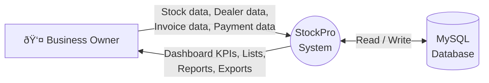
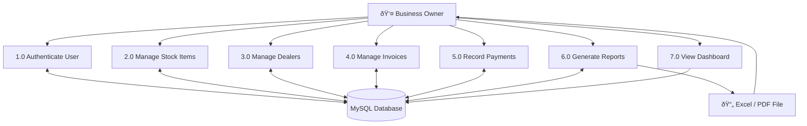
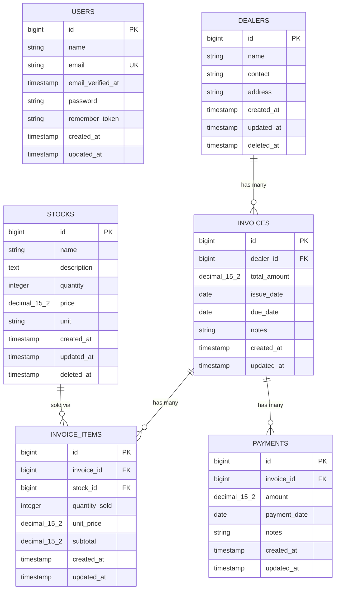
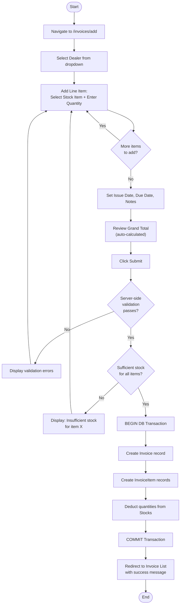
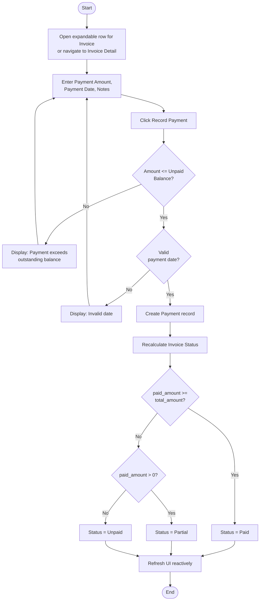
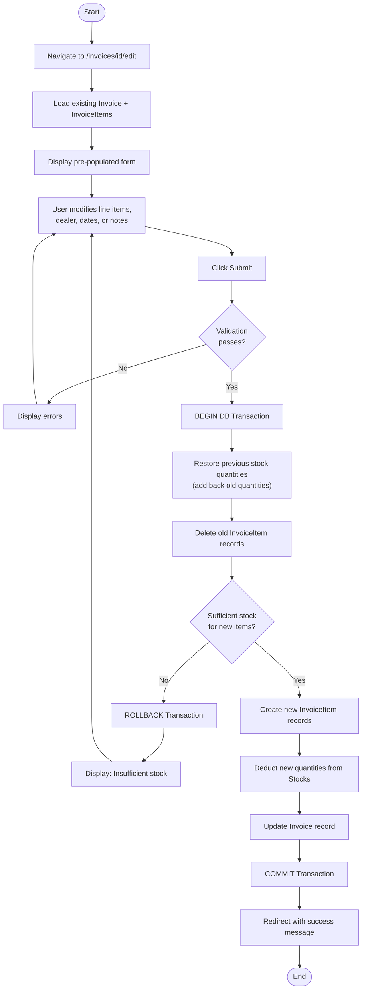
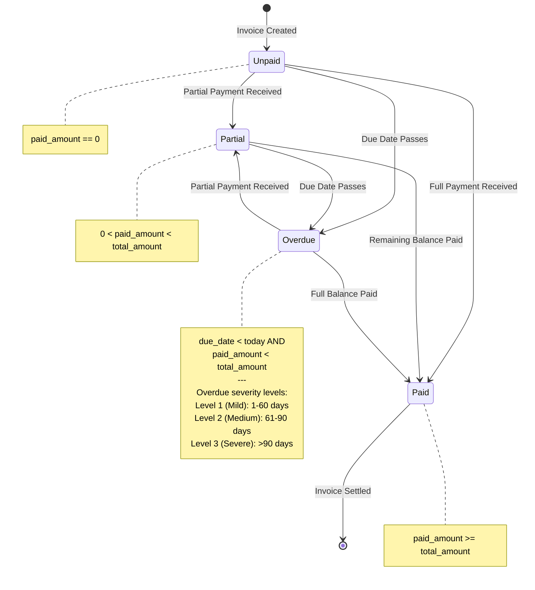

# Software Requirements Specification

## StockPro — Inventory Management System

---

| **Field**            | **Value**                                              |
| -------------------- | ------------------------------------------------------ |
| **Document Title**   | Software Requirements Specification (SRS)              |
| **Product Name**     | StockPro — Inventory Management System                 |
| **Version**          | 1.0                                                    |
| **Date**             | 18 March 2026                                          |
| **Prepared By**      | StockPro Development Team                              |
| **Client**           | Small-to-Medium Enterprises (SMEs), Sri Lanka          |
| **Confidentiality**  | Internal / Client-Confidential                         |
| **Standard**         | IEEE 830-1998 (IEEE Recommended Practice for SRS)      |

---

## Revision History

| **Version** | **Date**       | **Author**              | **Description of Changes**             |
| ----------- | -------------- | ----------------------- | -------------------------------------- |
| 1.0         | 18 March 2026  | StockPro Development Team | Initial SRS release                  |

---

## Table of Contents

- [1. Introduction](#1-introduction)
  - [1.1 Purpose](#11-purpose)
  - [1.2 Scope](#12-scope)
  - [1.3 Definitions, Acronyms, and Abbreviations](#13-definitions-acronyms-and-abbreviations)
  - [1.4 References](#14-references)
  - [1.5 Overview](#15-overview)
- [2. Overall Description](#2-overall-description)
  - [2.1 Product Perspective](#21-product-perspective)
  - [2.2 Product Functions](#22-product-functions)
  - [2.3 User Classes and Characteristics](#23-user-classes-and-characteristics)
  - [2.4 Operating Environment](#24-operating-environment)
  - [2.5 Design and Implementation Constraints](#25-design-and-implementation-constraints)
  - [2.6 Assumptions and Dependencies](#26-assumptions-and-dependencies)
- [3. Specific Requirements](#3-specific-requirements) *(see Part 2)*
  - [3.1 External Interfaces](#31-external-interfaces)
  - [3.2 Functional Requirements](#32-functional-requirements)
  - [3.3 Non-Functional Requirements](#33-non-functional-requirements)
- [4. Supporting Information](#4-supporting-information) *(see Part 3)*
  - [4.1 System Context Diagram](#41-system-context-diagram)
  - [4.2 High-Level Data Flow Diagram](#42-high-level-data-flow-diagram)
  - [4.3 Entity-Relationship Diagram](#43-entity-relationship-diagram)
  - [4.4 Use Case Diagram](#44-use-case-diagram)
  - [4.5 Activity Diagram — Create Invoice Flow](#45-activity-diagram--create-invoice-flow)
  - [4.6 State Diagram — Invoice Lifecycle](#46-state-diagram--invoice-lifecycle)

---

## 1. Introduction

### 1.1 Purpose

This Software Requirements Specification (SRS) provides a complete and unambiguous description of the functional and non-functional requirements for **StockPro**, a web-based Inventory Management System. The document is intended for:

- **Developers and engineers** — as a binding implementation reference.
- **Quality assurance personnel** — as the basis for test plan derivation.
- **Project stakeholders and business owners** — as a formal agreement on system capabilities.
- **Future maintainers** — as a baseline for change-impact analysis.

This document conforms to the IEEE 830-1998 standard for Software Requirements Specifications.

### 1.2 Scope

**StockPro** is a web-based inventory management application designed to replace manual, Excel-based tracking of stock, invoices, partial payments, dealer balances, and overdue tracking for small-to-medium-sized businesses (SMBs) in Sri Lanka. The system targets hardware shops, building materials suppliers, and general trading companies.

**In-scope capabilities (v1.0):**

| **Capability**                  | **Description**                                                                                      |
| ------------------------------- | ---------------------------------------------------------------------------------------------------- |
| Authentication                  | Secure login/logout via Laravel Breeze                                                               |
| Dashboard                       | Real-time KPIs: stock value, low-stock alerts, outstanding receivables, overdue invoices, recent activity |
| Stock Management                | CRUD for stock items with search, filter, pagination, low-stock highlighting, and soft deletes        |
| Dealer Management               | CRUD for dealers/customers/suppliers with soft deletes and financial summaries                        |
| Invoice Management              | Create, edit, view invoices with multi-item line items, automatic stock deduction, and status tracking |
| Payment Management              | Record partial/full payments against invoices with over-payment validation                            |
| Reports & Exports               | Dealer-wise summary reports with Excel (XLSX) and PDF export                                         |

**Out-of-scope (deferred to future releases):**

- Multi-user role-based access control (Admin / Staff roles)
- Purchase order management and supplier invoicing
- Barcode/QR code scanning
- Multi-currency or multi-branch support
- REST/GraphQL API for third-party integrations
- Automated email notifications and reminders

### 1.3 Definitions, Acronyms, and Abbreviations

| **Term**       | **Definition**                                                                                         |
| -------------- | ------------------------------------------------------------------------------------------------------ |
| **SRS**        | Software Requirements Specification                                                                    |
| **SMB/SME**    | Small-to-Medium Business / Enterprise                                                                  |
| **LKR**        | Sri Lankan Rupee — the primary currency used throughout the system                                     |
| **CRUD**       | Create, Read, Update, Delete — the four basic data operations                                          |
| **Dealer**     | A customer, client, or supplier entity who receives invoices and makes payments                         |
| **Stock Item** | A product or material tracked in inventory (e.g., cement bags, steel rods, paint tins)                 |
| **Invoice**    | A financial document recording a sale of one or more stock items to a dealer                            |
| **Payment**    | A monetary transaction recorded against an invoice (partial or full)                                    |
| **Overdue**    | An invoice whose due date has passed and whose balance remains unpaid                                   |
| **Soft Delete**| A logical deletion that retains the database record (via `deleted_at` timestamp) for data integrity    |
| **Livewire**   | A Laravel framework for building reactive, dynamic UIs without writing JavaScript                       |
| **ERD**        | Entity-Relationship Diagram                                                                            |
| **CSRF**       | Cross-Site Request Forgery — a web security attack vector                                              |
| **KPI**        | Key Performance Indicator                                                                              |
| **DFD**        | Data Flow Diagram                                                                                      |

### 1.4 References

| **#** | **Reference**                                                                                           |
| ----- | ------------------------------------------------------------------------------------------------------- |
| 1     | IEEE Std 830-1998 — IEEE Recommended Practice for Software Requirements Specifications                  |
| 2     | Laravel 12.x Official Documentation — https://laravel.com/docs/12.x                                    |
| 3     | Livewire 3.x Official Documentation — https://livewire.laravel.com/docs                                |
| 4     | Tailwind CSS 3.x Documentation — https://tailwindcss.com/docs                                          |
| 5     | Laravel Breeze Documentation — https://laravel.com/docs/12.x/starter-kits#laravel-breeze               |
| 6     | Maatwebsite Excel 3.1 Documentation — https://docs.laravel-excel.com/3.1/                              |
| 7     | Barryvdh Laravel DomPDF — https://github.com/barryvdh/laravel-dompdf                                   |
| 8     | MySQL 8.x Reference Manual — https://dev.mysql.com/doc/refman/8.0/en/                                  |

### 1.5 Overview

The remainder of this document is organized as follows:

- **Section 2 — Overall Description**: High-level view of the product, its functions, user characteristics, operating environment, constraints, and assumptions.
- **Section 3 — Specific Requirements**: All functional requirements (organized by module, in use-case style) and non-functional requirements (performance, security, usability, reliability, scalability, maintainability).
- **Section 4 — Supporting Information**: Diagrams including System Context, Data Flow, ERD, Use Case, Activity, and State diagrams.

---

## 2. Overall Description

### 2.1 Product Perspective

StockPro is a **self-contained, standalone web application**. It is not a component of a larger system. The application replaces ad-hoc Microsoft Excel spreadsheets currently used by target businesses to track inventory, sales invoices, and customer payment balances.

The system is deployed as a monolithic Laravel application and accessed through a standard web browser. No external system integrations exist in version 1.0.

```mermaid
graph LR
    A["👤 Business Owner / Staff"] -->|"HTTPS (Browser)"| B["🖥️ StockPro Web Application"]
    B -->|"SQL Queries"| C["🗄️ MySQL Database"]
    B -->|"File Generation"| D["📄 Excel / PDF Reports"]
```

### 2.2 Product Functions

| **ID**   | **Function**                     | **Summary**                                                                              |
| -------- | -------------------------------- | ---------------------------------------------------------------------------------------- |
| PF-01    | User Authentication              | Secure login/logout with session management via Laravel Breeze                           |
| PF-02    | Dashboard Overview               | Real-time display of KPIs: stock value, low-stock alerts, receivables, overdue count     |
| PF-03    | Stock Item Management            | CRUD operations for inventory items with search, filter, pagination, soft delete          |
| PF-04    | Dealer Management                | CRUD operations for dealers/customers with financial summaries and soft delete            |
| PF-05    | Invoice Management               | Create/edit/view invoices with multi-item lines, automatic stock deduction, status tracking |
| PF-06    | Payment Recording                | Partial/full payment entry with over-payment prevention and payment history               |
| PF-07    | Reporting & Export               | Dealer-wise summary reports; export to Excel (XLSX) and PDF formats                      |

### 2.3 User Classes and Characteristics

| **User Class**              | **Description**                                                                                  | **Technical Proficiency** | **Frequency** |
| --------------------------- | ------------------------------------------------------------------------------------------------ | ------------------------- | ------------- |
| **Business Owner**          | Primary user. Manages all operations: stock, invoices, payments, reports. Full system access.     | Low to Moderate           | Daily         |
| **Staff Member** *(future)* | Day-to-day data entry (stock updates, invoice creation, payments). Restricted access in future.   | Low                       | Daily         |

> [!NOTE]
> Version 1.0 operates as a single-user system. Multi-user role-based access (Admin/Staff) is planned for a future release.

### 2.4 Operating Environment

| **Component**            | **Specification**                                                  |
| ------------------------ | ------------------------------------------------------------------ |
| **Server-side Runtime**  | PHP 8.2 or higher                                                  |
| **Framework**            | Laravel 12.x                                                       |
| **Reactive UI Layer**    | Livewire 3.x, Volt 1.7.x                                          |
| **CSS Framework**        | Tailwind CSS 3.x                                                   |
| **Icon Library**         | Lucide Icons                                                       |
| **Database**             | MySQL 8.x (InnoDB engine)                                          |
| **Web Server**           | Apache 2.4+ or Nginx 1.18+                                        |
| **Client Browsers**      | Chrome 100+, Firefox 100+, Edge 100+, Safari 15+                   |
| **Supported Devices**    | Desktop, Tablet, Mobile (responsive design)                        |
| **Export Libraries**     | Maatwebsite Excel 3.1 (XLSX), Barryvdh DomPDF 3.1 (PDF)           |

### 2.5 Design and Implementation Constraints

| **ID**  | **Constraint**                                                                                                       |
| ------- | -------------------------------------------------------------------------------------------------------------------- |
| DC-01   | The system SHALL be implemented using the Laravel 12.x PHP framework.                                                |
| DC-02   | All reactive UI components SHALL be implemented using Livewire 3.x (no separate SPA framework).                      |
| DC-03   | The database SHALL be MySQL 8.x with InnoDB to support foreign keys and transactions.                                |
| DC-04   | All monetary values SHALL be stored as `DECIMAL(15,2)` to prevent floating-point precision errors.                   |
| DC-05   | The primary currency SHALL be Sri Lankan Rupees (LKR). Multi-currency is not in scope for v1.0.                      |
| DC-06   | Authentication SHALL use Laravel Breeze's session-based authentication middleware.                                     |
| DC-07   | All UI styling SHALL use Tailwind CSS utility classes.                                                                |
| DC-08   | Soft deletes SHALL use Laravel's `SoftDeletes` trait (`deleted_at` timestamp column).                                 |
| DC-09   | Excel exports SHALL use Maatwebsite Excel 3.1; PDF exports SHALL use Barryvdh DomPDF 3.1.                            |

### 2.6 Assumptions and Dependencies

**Assumptions:**

| **ID**  | **Assumption**                                                                                                     |
| ------- | ------------------------------------------------------------------------------------------------------------------ |
| AS-01   | The target user has access to a modern web browser with JavaScript enabled.                                        |
| AS-02   | The business operates with a single inventory location (no multi-warehouse tracking).                              |
| AS-03   | All financial transactions are denominated in Sri Lankan Rupees (LKR).                                             |
| AS-04   | The user has basic computer literacy (can navigate a website, fill forms, click buttons).                           |
| AS-05   | The hosting environment provides PHP 8.2+, MySQL 8.x, and Composer.                                               |
| AS-06   | Expected data volume does not exceed 10,000 records per entity within the first 2 years.                           |

**Dependencies:**

| **ID**  | **Dependency**                                                               |
| ------- | ---------------------------------------------------------------------------- |
| DP-01   | Laravel Framework 12.x — core application framework                         |
| DP-02   | Livewire 3.x — reactive component rendering                                 |
| DP-03   | Livewire Volt 1.7.x — single-file Livewire component authoring              |
| DP-04   | Laravel Breeze 2.3.x — authentication scaffolding                           |
| DP-05   | Maatwebsite Excel 3.1.x — spreadsheet generation and export                 |
| DP-06   | Barryvdh DomPDF 3.1.x — PDF rendering and export                            |
| DP-07   | Tailwind CSS 3.x — utility-first CSS framework (compiled via Vite)           |
| DP-08   | MySQL 8.x — relational database management system                           |
| DP-09   | Vite — frontend asset bundler (JavaScript, CSS)                              |
# SRS StockPro — Part 2: Specific Requirements (Section 3)

> This document continues from [Part 1](./SRS_StockPro_Part1.md).

---

## 3. Specific Requirements

### 3.1 External Interfaces

#### 3.1.1 User Interface

| **ID**   | **Interface**                    | **Description**                                                                                                          |
| -------- | -------------------------------- | ------------------------------------------------------------------------------------------------------------------------ |
| UI-01    | Login Page                       | Form with email and password fields, "Remember Me" checkbox, and submit button. Displays validation errors inline.       |
| UI-02    | Dashboard                        | Card-based layout showing: Total Stock Value (LKR), Low-Stock Alerts, Total Outstanding Receivables, Overdue Invoices, and a Recent Invoices table. |
| UI-03    | Stock List Page                  | Paginated table of all stock items with columns: Name, Description, Quantity, Unit Price (LKR), Unit. Includes search bar, filter controls, and action buttons (Edit, Delete). Low-stock rows highlighted visually. |
| UI-04    | Stock Add/Edit Form              | Form with fields: Name (required), Description (optional), Quantity (required, integer ≥ 0), Unit Price (required, decimal), Unit (optional, e.g. "kg", "pcs"). |
| UI-05    | Dealer List Page                 | Paginated table with columns: Name, Contact, Address, Total Invoiced, Total Paid, Outstanding, Overdue (>60 / >90 days). Action buttons: Edit, Delete. |
| UI-06    | Dealer Add/Edit Form             | Form with fields: Name (required), Contact (optional), Address (optional).                                               |
| UI-07    | Invoice List Page                | Paginated table with columns: Invoice #, Dealer Name, Total Amount, Paid Amount, Balance, Status, Issue Date, Due Date. Expandable row per invoice showing line items and payment history. Inline payment entry form. Filters: dealer, status, date range, overdue. |
| UI-08    | Invoice Add/Edit Form            | Form: Dealer selector, dynamic line items (Stock Item selector, Quantity input, auto-calculated Subtotal), Issue Date, Due Date, Notes. Grand Total auto-calculated. |
| UI-09    | Invoice Detail Page              | Print-friendly single-invoice view: dealer info, line items table, payment history, totals, status badge.                 |
| UI-10    | Summary Report Page              | Table: Dealer Name, Invoice Count, Total Invoiced, Total Paid, Outstanding, Overdue (>60 days), Overdue (>90 days). Export buttons for Excel and PDF. |
| UI-11    | Navigation Sidebar               | Persistent sidebar with links: Dashboard, Stocks, Dealers, Invoices, Summary Report, Profile. Responsive (collapsible on mobile). |
| UI-12    | Dark Mode Toggle                 | Theme toggle switch in the navigation area allowing the user to switch between light and dark modes. Preference persists via local storage. |

#### 3.1.2 Report / Export Interfaces

| **ID**   | **Interface**                    | **Description**                                                                                                          |
| -------- | -------------------------------- | ------------------------------------------------------------------------------------------------------------------------ |
| EI-01    | Excel Export (Dealer Summary)    | Downloads an `.xlsx` file containing: Dealer Name, Number of Invoices, Total Invoiced (LKR), Total Paid (LKR), Outstanding (LKR). Styled header row (bold, colored). File named `dealer-summary-YYYY-MM-DD.xlsx`. |
| EI-02    | PDF Export (Dealer Summary)      | Downloads a landscape A4 PDF containing the same dealer summary data. File named `dealer-summary-YYYY-MM-DD.pdf`.       |
| EI-03    | Print View (Invoice Detail)      | A print-friendly layout of a single invoice, rendered as a standard HTML page without navigation chrome, suitable for `window.print()`. |

---

### 3.2 Functional Requirements

> Requirements are numbered sequentially (REQ-001 through REQ-038) and organized by module. Each requirement includes preconditions, main flow, alternative/exception flows, and postconditions in use-case style.

---

#### 3.2.1 Module: Authentication & User Management

##### REQ-001 — User Login

| **Attribute**       | **Description**                                                                                   |
| ------------------- | ------------------------------------------------------------------------------------------------- |
| **Priority**        | HIGH                                                                                              |
| **Preconditions**   | A valid user account exists in the `users` table. The user is not currently authenticated.          |
| **Main Flow**       | 1. User navigates to the login page (`/login`). 2. User enters email and password. 3. System validates credentials against the `users` table via Laravel Breeze. 4. On success, system creates an authenticated session and redirects to the Dashboard (`/`). |
| **Alternative Flow**| **AF-001a**: If credentials are invalid, display "These credentials do not match our records." and remain on the login page. **AF-001b**: If the "Remember Me" checkbox is selected, the session SHALL persist beyond browser closure. |
| **Postconditions**  | User is authenticated. All subsequent requests are authorized via session middleware.              |

##### REQ-002 — User Logout

| **Attribute**       | **Description**                                                                                   |
| ------------------- | ------------------------------------------------------------------------------------------------- |
| **Priority**        | HIGH                                                                                              |
| **Preconditions**   | User is currently authenticated.                                                                  |
| **Main Flow**       | 1. User clicks the "Logout" action. 2. System invalidates the session. 3. System redirects to the login page. |
| **Postconditions**  | Session is destroyed. User must re-authenticate to access any protected route.                    |

##### REQ-003 — Route Protection

| **Attribute**       | **Description**                                                                                   |
| ------------------- | ------------------------------------------------------------------------------------------------- |
| **Priority**        | HIGH                                                                                              |
| **Preconditions**   | None.                                                                                             |
| **Main Flow**       | All application routes (except `/login` and authentication routes) SHALL be protected by the `auth` middleware. Unauthenticated requests SHALL be redirected to the login page. |
| **Postconditions**  | Only authenticated users can access application functionality.                                    |

---

#### 3.2.2 Module: Dashboard

##### REQ-004 — Display Total Stock Value

| **Attribute**       | **Description**                                                                                   |
| ------------------- | ------------------------------------------------------------------------------------------------- |
| **Priority**        | HIGH                                                                                              |
| **Preconditions**   | User is authenticated and on the Dashboard page.                                                  |
| **Main Flow**       | System calculates `SUM(quantity × price)` across all non-deleted stock items and displays the result formatted as LKR with two decimal places. |
| **Postconditions**  | The total stock value KPI card is rendered with the current computed value.                        |

##### REQ-005 — Display Low-Stock Alerts

| **Attribute**       | **Description**                                                                                   |
| ------------------- | ------------------------------------------------------------------------------------------------- |
| **Priority**        | MEDIUM                                                                                            |
| **Preconditions**   | User is authenticated and on the Dashboard page.                                                  |
| **Main Flow**       | System queries stock items where `quantity ≤ LOW_STOCK_THRESHOLD` (default: 10), ordered ascending by quantity, limited to 5 items. Each item is displayed with its name, current quantity, and unit. |
| **Alternative Flow**| If no items are below the threshold, display a "No low-stock items" message.                      |
| **Postconditions**  | Low-stock alert section is rendered.                                                              |

##### REQ-006 — Display Outstanding Receivables and Recent Invoices

| **Attribute**       | **Description**                                                                                   |
| ------------------- | ------------------------------------------------------------------------------------------------- |
| **Priority**        | HIGH                                                                                              |
| **Preconditions**   | User is authenticated and on the Dashboard page.                                                  |
| **Main Flow**       | 1. System calculates total outstanding receivables as `SUM(total_amount - paid_amount)` across all invoices. 2. System retrieves the top 5 dealers with the highest overdue outstanding amounts. 3. System retrieves the 5 most recent invoices with dealer name and status. 4. All values are displayed on the Dashboard. |
| **Postconditions**  | Outstanding receivables, overdue dealers, and recent invoices sections are rendered.               |

---

#### 3.2.3 Module: Stock Management

##### REQ-007 — List Stock Items

| **Attribute**       | **Description**                                                                                   |
| ------------------- | ------------------------------------------------------------------------------------------------- |
| **Priority**        | HIGH                                                                                              |
| **Preconditions**   | User is authenticated.                                                                            |
| **Main Flow**       | 1. User navigates to `/stocks`. 2. System displays a paginated table of all non-deleted stock items with columns: Name, Description, Quantity, Unit Price (LKR), Unit. 3. Rows where `quantity ≤ LOW_STOCK_THRESHOLD` SHALL be visually highlighted (e.g., warning background color). |
| **Postconditions**  | Stock list is displayed with pagination controls.                                                 |

##### REQ-008 — Search and Filter Stock Items

| **Attribute**       | **Description**                                                                                   |
| ------------------- | ------------------------------------------------------------------------------------------------- |
| **Priority**        | MEDIUM                                                                                            |
| **Preconditions**   | User is on the Stock List page.                                                                   |
| **Main Flow**       | 1. User types into the search bar. 2. System filters the stock list in real-time (via Livewire) matching against the `name` and `description` fields. 3. Results update dynamically without full page reload. |
| **Postconditions**  | Only matching stock items are displayed.                                                          |

##### REQ-009 — Create Stock Item

| **Attribute**       | **Description**                                                                                   |
| ------------------- | ------------------------------------------------------------------------------------------------- |
| **Priority**        | HIGH                                                                                              |
| **Preconditions**   | User is authenticated.                                                                            |
| **Main Flow**       | 1. User navigates to `/stocks/add`. 2. User fills in: Name (required, string), Description (optional, text), Quantity (required, integer ≥ 0), Unit Price (required, decimal > 0), Unit (optional, string). 3. User submits the form. 4. System validates inputs. 5. On success, system creates a new record in the `stocks` table and redirects to the Stock List with a success message. |
| **Alternative Flow**| **AF-009a**: If validation fails, display inline error messages and retain form input values.      |
| **Postconditions**  | A new stock item record exists in the database.                                                   |

##### REQ-010 — Edit Stock Item

| **Attribute**       | **Description**                                                                                   |
| ------------------- | ------------------------------------------------------------------------------------------------- |
| **Priority**        | HIGH                                                                                              |
| **Preconditions**   | The stock item exists and is not soft-deleted.                                                    |
| **Main Flow**       | 1. User navigates to `/stocks/{id}/edit`. 2. System pre-populates the form with existing values. 3. User modifies fields and submits. 4. System validates and updates the record. 5. Redirect to Stock List with success message. |
| **Postconditions**  | The stock item record is updated in the database.                                                 |

##### REQ-011 — Soft Delete Stock Item

| **Attribute**       | **Description**                                                                                   |
| ------------------- | ------------------------------------------------------------------------------------------------- |
| **Priority**        | HIGH                                                                                              |
| **Preconditions**   | The stock item exists and is not soft-deleted.                                                    |
| **Main Flow**       | 1. User clicks the Delete button for a stock item. 2. System checks if the stock item is referenced in any `invoice_items` record (via `stock_id` foreign key with `ON DELETE RESTRICT`). 3. If not referenced, system sets `deleted_at` timestamp (soft delete). 4. Stock item no longer appears in the list. |
| **Alternative Flow**| **AF-011a**: If the stock item is referenced in active invoice items, the system SHALL prevent deletion and display: "Cannot delete: this item is used in one or more invoices." |
| **Postconditions**  | The stock item is logically deleted (or action is blocked with a reason).                         |

##### REQ-012 — Low-Stock Visual Highlighting

| **Attribute**       | **Description**                                                                                   |
| ------------------- | ------------------------------------------------------------------------------------------------- |
| **Priority**        | MEDIUM                                                                                            |
| **Preconditions**   | Stock list is being rendered.                                                                     |
| **Main Flow**       | The system SHALL apply visual highlighting (distinct background color or badge) to any stock item row where `quantity ≤ LOW_STOCK_THRESHOLD` (default: 10). |
| **Postconditions**  | Low-stock items are visually distinguishable in the list.                                         |

##### REQ-013 — Stock Quantity Validation

| **Attribute**       | **Description**                                                                                   |
| ------------------- | ------------------------------------------------------------------------------------------------- |
| **Priority**        | HIGH                                                                                              |
| **Preconditions**   | User is creating or editing a stock item.                                                         |
| **Main Flow**       | The system SHALL validate that: (a) `quantity` is a non-negative integer (≥ 0), (b) `price` is a positive decimal (> 0), (c) `name` is a non-empty string. |
| **Postconditions**  | Only valid data is persisted to the database.                                                     |

---

#### 3.2.4 Module: Dealer Management

##### REQ-014 — List Dealers

| **Attribute**       | **Description**                                                                                   |
| ------------------- | ------------------------------------------------------------------------------------------------- |
| **Priority**        | HIGH                                                                                              |
| **Preconditions**   | User is authenticated.                                                                            |
| **Main Flow**       | 1. User navigates to `/dealers`. 2. System displays a paginated table of all non-deleted dealers with columns: Name, Contact, Address. 3. For each dealer, the system calculates and displays: Total Invoiced (LKR), Total Paid (LKR), Outstanding (LKR). |
| **Postconditions**  | Dealer list is displayed.                                                                        |

##### REQ-015 — Create Dealer

| **Attribute**       | **Description**                                                                                   |
| ------------------- | ------------------------------------------------------------------------------------------------- |
| **Priority**        | HIGH                                                                                              |
| **Preconditions**   | User is authenticated.                                                                            |
| **Main Flow**       | 1. User navigates to `/dealers/add`. 2. User fills in: Name (required), Contact (optional), Address (optional). 3. System validates and creates a new record in the `dealers` table. 4. Redirect to Dealer List with success message. |
| **Alternative Flow**| **AF-015a**: If name is empty, display validation error.                                          |
| **Postconditions**  | A new dealer record exists in the database.                                                       |

##### REQ-016 — Edit Dealer

| **Attribute**       | **Description**                                                                                   |
| ------------------- | ------------------------------------------------------------------------------------------------- |
| **Priority**        | HIGH                                                                                              |
| **Preconditions**   | The dealer exists and is not soft-deleted.                                                        |
| **Main Flow**       | 1. User navigates to `/dealers/{id}/edit`. 2. System pre-populates form. 3. User modifies and submits. 4. System validates and updates. 5. Redirect with success message. |
| **Postconditions**  | Dealer record is updated.                                                                        |

##### REQ-017 — Soft Delete Dealer

| **Attribute**       | **Description**                                                                                   |
| ------------------- | ------------------------------------------------------------------------------------------------- |
| **Priority**        | HIGH                                                                                              |
| **Preconditions**   | The dealer exists and is not soft-deleted.                                                        |
| **Main Flow**       | 1. User clicks Delete on a dealer. 2. System checks if the dealer has any associated invoices. 3. If no associated invoices, system soft-deletes the dealer. |
| **Alternative Flow**| **AF-017a**: If the dealer has associated invoices, prevent deletion and display: "Cannot delete: this dealer has associated invoices." |
| **Postconditions**  | Dealer is logically deleted (or action is blocked with a reason).                                 |

##### REQ-018 — Dealer Financial Summary

| **Attribute**       | **Description**                                                                                   |
| ------------------- | ------------------------------------------------------------------------------------------------- |
| **Priority**        | MEDIUM                                                                                            |
| **Preconditions**   | Dealer list or detail page is being rendered.                                                     |
| **Main Flow**       | For each dealer, the system SHALL calculate and display: (a) Total Invoiced — sum of `total_amount` across all invoices, (b) Total Paid — sum of all payment amounts across all invoices, (c) Outstanding — Total Invoiced minus Total Paid, (d) Overdue > 60 days — count of unpaid invoices overdue by more than 60 days, (e) Overdue > 90 days — count of unpaid invoices overdue by more than 90 days. |
| **Postconditions**  | Financial summary data is displayed per dealer.                                                   |

##### REQ-019 — Search Dealers

| **Attribute**       | **Description**                                                                                   |
| ------------------- | ------------------------------------------------------------------------------------------------- |
| **Priority**        | MEDIUM                                                                                            |
| **Preconditions**   | User is on the Dealer List page.                                                                  |
| **Main Flow**       | User types a search query; system filters the dealer list dynamically by name or contact.          |
| **Postconditions**  | Only matching dealers are shown.                                                                  |

---

#### 3.2.5 Module: Invoice Management

##### REQ-020 — List Invoices

| **Attribute**       | **Description**                                                                                   |
| ------------------- | ------------------------------------------------------------------------------------------------- |
| **Priority**        | HIGH                                                                                              |
| **Preconditions**   | User is authenticated.                                                                            |
| **Main Flow**       | 1. User navigates to `/invoices`. 2. System displays a paginated table with columns: Invoice ID, Dealer Name, Total Amount (LKR), Paid Amount (LKR), Balance (LKR), Status (badge), Issue Date, Due Date. 3. Each row is expandable to show line items and payment history. |
| **Postconditions**  | Invoice list is displayed.                                                                        |

##### REQ-021 — Filter and Search Invoices

| **Attribute**       | **Description**                                                                                   |
| ------------------- | ------------------------------------------------------------------------------------------------- |
| **Priority**        | MEDIUM                                                                                            |
| **Preconditions**   | User is on the Invoice List page.                                                                 |
| **Main Flow**       | System provides filter controls for: (a) Dealer (dropdown), (b) Status (Unpaid, Partial, Paid, Overdue), (c) Date range (issue date from/to), (d) Overdue only toggle. Filters apply in real-time via Livewire. |
| **Postconditions**  | Invoice list reflects applied filters.                                                            |

##### REQ-022 — Create Invoice

| **Attribute**       | **Description**                                                                                   |
| ------------------- | ------------------------------------------------------------------------------------------------- |
| **Priority**        | HIGH                                                                                              |
| **Preconditions**   | At least one dealer and one stock item exist.                                                     |
| **Main Flow**       | 1. User navigates to `/invoices/add`. 2. User selects a Dealer from a dropdown. 3. User adds one or more line items: selects a Stock Item, enters Quantity — Subtotal auto-calculates as `quantity × unit_price`. 4. Grand Total auto-calculates as sum of all subtotals. 5. User sets Issue Date (defaults to today), Due Date (optional), and Notes (optional). 6. User submits the form. 7. System validates all inputs. 8. System creates the Invoice record, creates InvoiceItem records, and deducts sold quantities from the `stocks` table. 9. Redirect to Invoice List with success message. |
| **Alternative Flow**| **AF-022a**: If requested quantity exceeds available stock, display: "Insufficient stock for [item name]. Available: [qty]." **AF-022b**: If no line items are added, display: "At least one item is required." |
| **Postconditions**  | Invoice and invoice items are created. Stock quantities are reduced accordingly.                   |

##### REQ-023 — Auto-Calculate Subtotals and Grand Total

| **Attribute**       | **Description**                                                                                   |
| ------------------- | ------------------------------------------------------------------------------------------------- |
| **Priority**        | HIGH                                                                                              |
| **Preconditions**   | User is on the Invoice Add/Edit form with at least one line item.                                 |
| **Main Flow**       | 1. When the user selects a stock item, the unit price is auto-populated from the stock record. 2. When the user enters quantity, `subtotal = quantity × unit_price` is calculated in real-time. 3. Grand total = sum of all line item subtotals, updated dynamically. |
| **Postconditions**  | Subtotals and grand total reflect the current line item data.                                     |

##### REQ-024 — Automatic Stock Deduction on Invoice Save

| **Attribute**       | **Description**                                                                                   |
| ------------------- | ------------------------------------------------------------------------------------------------- |
| **Priority**        | HIGH (Critical)                                                                                   |
| **Preconditions**   | Invoice form is submitted with valid line items.                                                  |
| **Main Flow**       | For each line item in the invoice, the system SHALL: 1. Verify `stock.quantity >= requested_quantity`. 2. Deduct `stock.quantity -= requested_quantity`. 3. Persist the updated stock quantity within the same database transaction as the invoice creation. |
| **Alternative Flow**| **AF-024a**: If stock is insufficient at the time of save (race condition), roll back the transaction and display an error. |
| **Postconditions**  | Stock quantities are accurately reduced. The operation is atomic (all-or-nothing via DB transaction). |

##### REQ-025 — Edit Invoice with Stock Restoration

| **Attribute**       | **Description**                                                                                   |
| ------------------- | ------------------------------------------------------------------------------------------------- |
| **Priority**        | HIGH                                                                                              |
| **Preconditions**   | The invoice exists.                                                                               |
| **Main Flow**       | 1. User navigates to `/invoices/{id}/edit`. 2. System pre-populates the form with existing invoice data and line items. 3. User modifies dealer, line items, dates, or notes. 4. On submit: (a) System restores previous stock quantities (adds back previously deducted amounts), (b) System deducts new quantities, (c) System updates the Invoice and InvoiceItem records. 5. Redirect with success message. |
| **Postconditions**  | Invoice is updated. Stock quantities reflect the net change.                                      |

##### REQ-026 — Invoice Status Determination

| **Attribute**       | **Description**                                                                                   |
| ------------------- | ------------------------------------------------------------------------------------------------- |
| **Priority**        | HIGH                                                                                              |
| **Preconditions**   | Invoice exists with a `total_amount` and zero or more payments.                                   |
| **Main Flow**       | The system SHALL compute invoice status as: **Paid** — `paid_amount >= total_amount`; **Partial** — `0 < paid_amount < total_amount`; **Unpaid** — `paid_amount == 0`; **Overdue** — displayed as an additional badge/flag when `due_date < current_date AND status != Paid`. |
| **Postconditions**  | Correct status badge is rendered for each invoice.                                                |

##### REQ-027 — Expandable Invoice Row (Items + Payments)

| **Attribute**       | **Description**                                                                                   |
| ------------------- | ------------------------------------------------------------------------------------------------- |
| **Priority**        | MEDIUM                                                                                            |
| **Preconditions**   | User is on the Invoice List page.                                                                 |
| **Main Flow**       | 1. User clicks to expand an invoice row. 2. System displays: (a) A table of line items (Stock Name, Quantity Sold, Unit Price, Subtotal), (b) A table of payments (Date, Amount, Notes), (c) An inline payment entry form (for REQ-031). |
| **Postconditions**  | Detailed invoice information is visible inline.                                                   |

##### REQ-028 — Invoice Detail Page (Print-Friendly)

| **Attribute**       | **Description**                                                                                   |
| ------------------- | ------------------------------------------------------------------------------------------------- |
| **Priority**        | MEDIUM                                                                                            |
| **Preconditions**   | User is authenticated and the invoice exists.                                                     |
| **Main Flow**       | 1. User navigates to `/invoices/{invoice}/detail`. 2. System displays a full-page invoice view with: Dealer information, Line items table, Payment history table, Totals (Grand Total, Paid, Balance), Status badge. 3. The page layout SHALL be optimized for printing (no navigation sidebar, clean margins). |
| **Postconditions**  | Print-friendly invoice detail is displayed.                                                       |

##### REQ-029 — Overdue Invoice Highlighting

| **Attribute**       | **Description**                                                                                   |
| ------------------- | ------------------------------------------------------------------------------------------------- |
| **Priority**        | MEDIUM                                                                                            |
| **Preconditions**   | Invoice list or detail page is being rendered.                                                    |
| **Main Flow**       | Invoices SHALL be highlighted by overdue severity: **Level 1 (Mild)** — 1–60 days overdue; **Level 2 (Medium)** — 61–90 days overdue; **Level 3 (Severe)** — >90 days overdue. Non-overdue invoices receive no overdue styling. |
| **Postconditions**  | Visual severity indicators are applied.                                                           |

---

#### 3.2.6 Module: Payment Management

##### REQ-030 — Record Payment Against Invoice

| **Attribute**       | **Description**                                                                                   |
| ------------------- | ------------------------------------------------------------------------------------------------- |
| **Priority**        | HIGH                                                                                              |
| **Preconditions**   | The invoice exists and `unpaid_amount > 0`.                                                       |
| **Main Flow**       | 1. User enters payment details: Amount (required, decimal > 0), Payment Date (required), Notes (optional). 2. System validates: `amount ≤ unpaid_amount`. 3. System creates a Payment record linked to the invoice. 4. Invoice status recalculates automatically. |
| **Alternative Flow**| **AF-030a**: If `amount > unpaid_amount`, display: "Payment amount exceeds the outstanding balance of LKR [balance]." |
| **Postconditions**  | Payment is recorded. Invoice `paid_amount` and `status` are updated.                              |

##### REQ-031 — Inline Payment Entry in Invoice List

| **Attribute**       | **Description**                                                                                   |
| ------------------- | ------------------------------------------------------------------------------------------------- |
| **Priority**        | MEDIUM                                                                                            |
| **Preconditions**   | User has expanded an invoice row (REQ-027).                                                       |
| **Main Flow**       | An inline payment form is displayed within the expandable row, allowing the user to record a payment without navigating to a separate page. Form fields: Amount, Payment Date, Notes. |
| **Postconditions**  | Payment is recorded; expandable row and invoice row data refresh reactively.                      |

##### REQ-032 — Over-Payment Prevention

| **Attribute**       | **Description**                                                                                   |
| ------------------- | ------------------------------------------------------------------------------------------------- |
| **Priority**        | HIGH                                                                                              |
| **Preconditions**   | User is recording a payment.                                                                      |
| **Main Flow**       | The system SHALL validate that the payment amount does not exceed the invoice's current unpaid amount (`total_amount - SUM(payments.amount)`). If the validation fails, the payment SHALL NOT be saved and an error message SHALL be displayed. |
| **Postconditions**  | No over-payment exists in the database.                                                           |

##### REQ-033 — Payment History Display

| **Attribute**       | **Description**                                                                                   |
| ------------------- | ------------------------------------------------------------------------------------------------- |
| **Priority**        | MEDIUM                                                                                            |
| **Preconditions**   | Invoice has one or more payments.                                                                 |
| **Main Flow**       | The system SHALL display a chronological list of all payments for an invoice showing: Payment Date, Amount (LKR), Notes. Visible in both the expandable row (REQ-027) and the Invoice Detail page (REQ-028). |
| **Postconditions**  | Payment history is accurately displayed.                                                          |

##### REQ-034 — Payment Date Validation

| **Attribute**       | **Description**                                                                                   |
| ------------------- | ------------------------------------------------------------------------------------------------- |
| **Priority**        | MEDIUM                                                                                            |
| **Preconditions**   | User is recording a payment.                                                                      |
| **Main Flow**       | The system SHALL validate that `payment_date` is a valid date. The payment date SHOULD NOT be earlier than the invoice's `issue_date`. |
| **Postconditions**  | Only valid payment dates are recorded.                                                            |

---

#### 3.2.7 Module: Reports & Exports

##### REQ-035 — Dealer-Wise Summary Report

| **Attribute**       | **Description**                                                                                   |
| ------------------- | ------------------------------------------------------------------------------------------------- |
| **Priority**        | HIGH                                                                                              |
| **Preconditions**   | User is authenticated. At least one dealer with invoices exists.                                  |
| **Main Flow**       | 1. User navigates to `/summary`. 2. System displays a table with columns: Dealer Name, Invoice Count, Total Invoiced (LKR), Total Paid (LKR), Outstanding (LKR), Overdue >60 Days (count), Overdue >90 Days (count). 3. Results are ordered by outstanding amount, descending. 4. Only dealers with `total_invoiced > 0` are shown. |
| **Postconditions**  | Summary report is displayed.                                                                      |

##### REQ-036 — Export Summary to Excel

| **Attribute**       | **Description**                                                                                   |
| ------------------- | ------------------------------------------------------------------------------------------------- |
| **Priority**        | MEDIUM                                                                                            |
| **Preconditions**   | User is on the Summary Report page.                                                               |
| **Main Flow**       | 1. User clicks the "Export Excel" button. 2. System generates an `.xlsx` file via Maatwebsite Excel with columns: Dealer Name, Number of Invoices, Total Invoiced (LKR), Total Paid (LKR), Outstanding (LKR). 3. The file is downloaded as `dealer-summary-YYYY-MM-DD.xlsx`. |
| **Postconditions**  | Excel file is downloaded to the user's device.                                                    |

##### REQ-037 — Export Summary to PDF

| **Attribute**       | **Description**                                                                                   |
| ------------------- | ------------------------------------------------------------------------------------------------- |
| **Priority**        | MEDIUM                                                                                            |
| **Preconditions**   | User is on the Summary Report page.                                                               |
| **Main Flow**       | 1. User clicks the "Export PDF" button. 2. System generates a landscape A4 PDF via Barryvdh DomPDF containing the same summary data. 3. The file is downloaded as `dealer-summary-YYYY-MM-DD.pdf`. |
| **Postconditions**  | PDF file is downloaded to the user's device.                                                      |

##### REQ-038 — Invoice Print Layout

| **Attribute**       | **Description**                                                                                   |
| ------------------- | ------------------------------------------------------------------------------------------------- |
| **Priority**        | MEDIUM                                                                                            |
| **Preconditions**   | User is on the Invoice Detail page (REQ-028).                                                     |
| **Main Flow**       | The invoice detail page SHALL provide a print-optimized layout that: (a) hides navigation and sidebar elements, (b) uses standard margins suitable for A4 paper, (c) is triggered via the browser's print function or a "Print" button. |
| **Postconditions**  | A clean, professional invoice can be printed from the browser.                                    |

---

### 3.3 Non-Functional Requirements

#### 3.3.1 Performance

| **ID**    | **Requirement**                                                                                                             |
| --------- | --------------------------------------------------------------------------------------------------------------------------- |
| NFR-001   | Page load time for any standard list page SHALL NOT exceed **2 seconds** under normal load (≤ 10,000 records per table).    |
| NFR-002   | Dashboard KPI calculations SHALL complete within **3 seconds** for datasets up to 10,000 invoices.                          |
| NFR-003   | Real-time search filtering (via Livewire) SHALL return results within **500 milliseconds** of the last keystroke.           |
| NFR-004   | Excel and PDF exports SHALL generate within **10 seconds** for datasets up to 1,000 dealer records.                         |

#### 3.3.2 Security

| **ID**    | **Requirement**                                                                                                             |
| --------- | --------------------------------------------------------------------------------------------------------------------------- |
| NFR-005   | All forms SHALL include CSRF token protection via Laravel's `@csrf` directive.                                              |
| NFR-006   | All user inputs SHALL be validated server-side before database persistence (no reliance on client-side-only validation).     |
| NFR-007   | The system SHALL use parameterized queries / Eloquent ORM exclusively to prevent SQL injection vulnerabilities.              |
| NFR-008   | User passwords SHALL be hashed using bcrypt (Laravel default) before storage.                                               |
| NFR-009   | Session cookies SHALL be set with `HttpOnly` and `Secure` flags in production.                                              |
| NFR-010   | Direct URL access to authenticated routes WITHOUT a valid session SHALL redirect to the login page.                         |

#### 3.3.3 Usability

| **ID**    | **Requirement**                                                                                                             |
| --------- | --------------------------------------------------------------------------------------------------------------------------- |
| NFR-011   | All form fields SHALL have clear, descriptive labels. Required fields SHALL be visually marked.                              |
| NFR-012   | All validation errors SHALL be displayed inline, adjacent to the relevant field along with a descriptive error message.      |
| NFR-013   | Success and error feedback messages SHALL be displayed as dismissible toast notifications or flash messages.                 |
| NFR-014   | The UI SHALL be responsive and functional on devices with viewport widths from 320px (mobile) to 2560px (desktop).          |
| NFR-015   | The system SHALL support full dark mode with a user-togglable theme switch. Theme preference SHALL persist via local storage.|
| NFR-016   | Navigation SHALL be intuitive: maximum 2 clicks to reach any primary function from the Dashboard.                           |

#### 3.3.4 Reliability

| **ID**    | **Requirement**                                                                                                             |
| --------- | --------------------------------------------------------------------------------------------------------------------------- |
| NFR-017   | Invoice creation (with stock deduction) SHALL be wrapped in a database transaction to ensure atomicity.                     |
| NFR-018   | Data integrity SHALL be enforced via foreign key constraints at the database level (InnoDB).                                |
| NFR-019   | Soft-deleted records SHALL be excluded from all list views and dropdowns but SHALL remain in the database.                  |
| NFR-020   | The system SHALL prevent deletion of entities (stock items, dealers) that are referenced by active records.                 |

#### 3.3.5 Scalability

| **ID**    | **Requirement**                                                                                                             |
| --------- | --------------------------------------------------------------------------------------------------------------------------- |
| NFR-021   | The database schema SHALL support up to 10,000 records per primary entity table without performance degradation.            |
| NFR-022   | Database indexes SHALL be applied to frequently queried columns (foreign keys, `deleted_at`, `due_date`).                   |

#### 3.3.6 Maintainability

| **ID**    | **Requirement**                                                                                                             |
| --------- | --------------------------------------------------------------------------------------------------------------------------- |
| NFR-023   | The codebase SHALL follow Laravel conventions (naming, directory structure, Eloquent patterns).                              |
| NFR-024   | All database schema changes SHALL be managed via Laravel migration files.                                                   |
| NFR-025   | Business logic SHALL reside in Livewire components or dedicated service classes, not in Blade templates.                    |
| NFR-026   | The system SHALL use Eloquent relationships and accessors for computed fields (e.g., `paid_amount`, `status`).              |
# SRS StockPro — Part 3: Supporting Information (Section 4)

> This document continues from [Part 2](./SRS_StockPro_Part2.md).

---

## 4. Supporting Information

### 4.1 System Context Diagram

The following diagram illustrates StockPro's position within its operational environment, showing the single external actor (Business Owner) and the system boundaries.

```mermaid
graph TB
    subgraph External
        U["👤 Business Owner"]
    end

    subgraph "StockPro System Boundary"
        WEB["🌐 Laravel Web Application<br/>(Livewire + Tailwind CSS)"]
        DB["🗄️ MySQL Database<br/>(InnoDB)"]
        EXP["📄 Export Engine<br/>(Excel / PDF)"]
    end

    U -->|"HTTPS<br/>Login, CRUD, Reports"| WEB
    WEB -->|"Eloquent ORM<br/>SQL Queries"| DB
    WEB -->|"Generate Report"| EXP
    EXP -->|"File Download"| U
    WEB -->|"HTML Response"| U
```

---

### 4.2 High-Level Data Flow Diagram

#### 4.2.1 Level 0 — Context DFD

#### 4.2.2 Level 1 — Process Decomposition

---

### 4.3 Entity-Relationship Diagram

The following ERD represents the actual database schema as implemented in the Laravel migration files.

**Key constraints:**
- `INVOICES.dealer_id` → `DEALERS.id` (foreign key, constrained)
- `INVOICE_ITEMS.invoice_id` → `INVOICES.id` (foreign key, `ON DELETE CASCADE`)
- `INVOICE_ITEMS.stock_id` → `STOCKS.id` (foreign key, `ON DELETE RESTRICT`)
- `PAYMENTS.invoice_id` → `INVOICES.id` (foreign key, `ON DELETE CASCADE`)
- `DEALERS` and `STOCKS` use soft deletes (`deleted_at` column)

---

### 4.4 Use Case Diagram

```mermaid
graph TB
    subgraph "StockPro System"
        UC1["UC-01: Login"]
        UC2["UC-02: Logout"]
        UC3["UC-03: View Dashboard"]
        UC4["UC-04: Create Stock Item"]
        UC5["UC-05: Edit Stock Item"]
        UC6["UC-06: Delete Stock Item"]
        UC7["UC-07: List / Search Stocks"]
        UC8["UC-08: Create Dealer"]
        UC9["UC-09: Edit Dealer"]
        UC10["UC-10: Delete Dealer"]
        UC11["UC-11: List / Search Dealers"]
        UC12["UC-12: Create Invoice"]
        UC13["UC-13: Edit Invoice"]
        UC14["UC-14: View Invoice Detail"]
        UC15["UC-15: List / Filter Invoices"]
        UC16["UC-16: Record Payment"]
        UC17["UC-17: View Payment History"]
        UC18["UC-18: View Summary Report"]
        UC19["UC-19: Export to Excel"]
        UC20["UC-20: Export to PDF"]
        UC21["UC-21: Print Invoice"]
        UC22["UC-22: Toggle Dark Mode"]
    end

    OWNER["👤 Business Owner"]

    OWNER --- UC1
    OWNER --- UC2
    OWNER --- UC3
    OWNER --- UC4
    OWNER --- UC5
    OWNER --- UC6
    OWNER --- UC7
    OWNER --- UC8
    OWNER --- UC9
    OWNER --- UC10
    OWNER --- UC11
    OWNER --- UC12
    OWNER --- UC13
    OWNER --- UC14
    OWNER --- UC15
    OWNER --- UC16
    OWNER --- UC17
    OWNER --- UC18
    OWNER --- UC19
    OWNER --- UC20
    OWNER --- UC21
    OWNER --- UC22
```

---

### 4.5 Activity Diagram — Create Invoice Flow

This diagram illustrates the end-to-end process flow when a user creates an invoice, including stock deduction and payment recording.

#### 4.5.1 Create Invoice Process

#### 4.5.2 Record Payment Process

#### 4.5.3 Edit Invoice Process (Stock Restoration)

---

### 4.6 State Diagram — Invoice Lifecycle

> [!IMPORTANT]
> "Overdue" is not a mutually exclusive status with Unpaid/Partial — it is an **overlay flag**. An invoice can be simultaneously "Partial" and "Overdue." The `status` computed attribute returns `paid`, `partial`, or `unpaid`, while overdue is determined independently via the `isOverdue()` method and `days_overdue` accessor.

---

### 4.7 Requirements Traceability Matrix

| **Use Case**                | **Functional Req.**          | **Non-Functional Req.**       | **Database Entity**        |
| --------------------------- | ---------------------------- | ----------------------------- | -------------------------- |
| UC-01: Login                | REQ-001                      | NFR-005, NFR-008, NFR-009     | Users                      |
| UC-02: Logout               | REQ-002                      | NFR-010                       | Users (session)            |
| UC-03: View Dashboard       | REQ-004, REQ-005, REQ-006    | NFR-001, NFR-002              | Stocks, Invoices, Dealers  |
| UC-04: Create Stock         | REQ-009, REQ-013             | NFR-006, NFR-007, NFR-011     | Stocks                     |
| UC-05: Edit Stock           | REQ-010, REQ-013             | NFR-006, NFR-007              | Stocks                     |
| UC-06: Delete Stock         | REQ-011                      | NFR-018, NFR-020              | Stocks, InvoiceItems       |
| UC-07: List/Search Stocks   | REQ-007, REQ-008, REQ-012    | NFR-001, NFR-003              | Stocks                     |
| UC-08: Create Dealer        | REQ-015                      | NFR-006, NFR-011              | Dealers                    |
| UC-09: Edit Dealer          | REQ-016                      | NFR-006                       | Dealers                    |
| UC-10: Delete Dealer        | REQ-017                      | NFR-018, NFR-020              | Dealers, Invoices          |
| UC-11: List/Search Dealers  | REQ-014, REQ-018, REQ-019    | NFR-001, NFR-003              | Dealers, Invoices, Payments|
| UC-12: Create Invoice       | REQ-022, REQ-023, REQ-024    | NFR-006, NFR-017, NFR-018     | Invoices, InvoiceItems, Stocks |
| UC-13: Edit Invoice         | REQ-025                      | NFR-017                       | Invoices, InvoiceItems, Stocks |
| UC-14: View Invoice Detail  | REQ-028                      | NFR-014                       | Invoices, InvoiceItems, Payments |
| UC-15: List/Filter Invoices | REQ-020, REQ-021, REQ-026, REQ-027, REQ-029 | NFR-001, NFR-003 | Invoices, Dealers          |
| UC-16: Record Payment       | REQ-030, REQ-032, REQ-034    | NFR-006, NFR-017              | Payments, Invoices         |
| UC-17: View Payment History | REQ-033                      | NFR-014                       | Payments                   |
| UC-18: View Summary Report  | REQ-035                      | NFR-001, NFR-002              | Dealers, Invoices, Payments|
| UC-19: Export to Excel      | REQ-036                      | NFR-004                       | Dealers, Invoices, Payments|
| UC-20: Export to PDF        | REQ-037                      | NFR-004                       | Dealers, Invoices, Payments|
| UC-21: Print Invoice        | REQ-038                      | NFR-014                       | Invoices                   |
| UC-22: Toggle Dark Mode     | —                            | NFR-015                       | — (client-side)            |

---

### 4.8 Glossary

| **Term**                   | **Definition**                                                                                          |
| -------------------------- | ------------------------------------------------------------------------------------------------------- |
| **Grand Total**            | The sum of all line-item subtotals on an invoice (`SUM(quantity_sold × unit_price)`)                    |
| **Outstanding Balance**    | The unpaid portion of an invoice (`total_amount - SUM(payments.amount)`)                                |
| **Overdue Bucket**         | A categorization of overdue invoices by severity: >60 days, >90 days                                   |
| **Soft Delete**            | Marking a record as deleted (via `deleted_at` timestamp) without physically removing it from the database |
| **Reactive Update**        | A UI update triggered by Livewire without a full page reload                                            |
| **Low-Stock Threshold**    | The configurable minimum quantity (default: 10) below which a stock item triggers visual alerts          |
| **Invoice Line Item**      | A single stock item entry on an invoice, stored in the `invoice_items` table                            |

---

> **End of SRS Document — StockPro v1.0**
>
> **Document Version**: 1.0 | **Date**: 18 March 2026 | **Standard**: IEEE 830-1998
